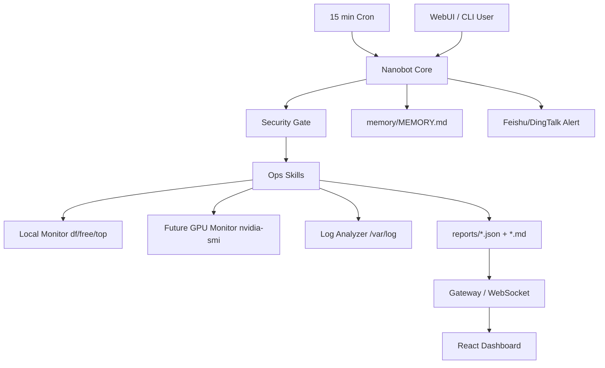

# 本机智能运维 Agent 与 Brown GPU 集群扩展设计

## 1. 项目概览

本项目当前实现一个本机智能运维 Agent MVP：用 Nanobot + DeepSeek API 完成本机状态巡检、日志诊断、报告输出和前端可视化。Brown University 实验室 14 台 A100/H100 GPU 服务器是项目的目标业务场景，系统设计保留多节点和 GPU 集群扩展能力。

## 2. 需求分析

### 当前 MVP 痛点

- 本机 Docker/Nanobot 运行状态需要可视化。
- CPU、内存、磁盘和日志异常需要一键巡检。
- 传统 dashboard 只能展示指标，无法用自然语言解释问题。
- 运维命令直接暴露给用户，有误操作风险。

### 目标场景痛点

- GPU 资源利用率不透明，空闲卡和满载卡难以及时发现。
- 磁盘满、显存泄露、训练进程异常退出会中断实验。
- 人工巡检滞后，故障发现可能延迟数小时。
- 直接开放 SSH 和 shell 权限容易误操作。

### 核心目标

- MVP 阶段先每 15 分钟巡检本机。
- 多节点阶段扩展到 14 台 GPU 节点。
- 使用本地规则预过滤正常日志，只将疑似异常上下文交给 LLM。
- 用 DeepSeek 低成本模型完成诊断摘要，控制日常 token 消耗。
- 用安全白名单限制 Agent 命令执行范围。
- 用 React Dashboard 展示实时健康状态和诊断过程。

## 3. 技术栈

- AI 引擎：Nanobot
- LLM Provider：DeepSeek API
- 后端运行时：Python 3.11 + Docker Compose
- 运维命令：`nvidia-smi`、`df`、`free`、`top`、`ss`、`grep`
- 前端：React 18 + TypeScript + Tailwind CSS
- 实时通信：WebSocket
- 告警：Feishu / DingTalk webhook

## 4. 系统架构



## 5. 模块设计

### Nanobot Core

负责模型交互、任务调度、工具调用和巡检报告汇总。当前使用 `deepseek-v4-flash` 作为默认模型，后续严重故障可切换更强模型做二次诊断。

### Exec Skill 层

封装底层诊断命令，重点输出结构化数据，减少 LLM 直接阅读大段原始日志的成本。

### Security Gate

通过 `AGENTS.md` 和后续脚本层白名单共同限制高危命令。默认允许只读诊断，禁止未经确认的删除、重启、kill 进程和系统配置修改。

### WebUI Dashboard

MVP 阶段展示本机健康卡片、巡检摘要、扩展节点预览和对话诊断窗口。扩展阶段展示 14 台节点健康卡片、GPU 指标、告警事件和巡检时间线。

### API Channel

前端诊断对话不直接执行 shell，也不通过 `docker exec nanobot agent -m` 绕过 Agent loop。项目提供 `api_channel/` 自定义 Nanobot channel：

- 前端发送 `POST /api/chat`。
- API channel 将消息封装为 Nanobot `InboundMessage`。
- Agent loop 消费消息，正常调用 skill、tool、memory。
- Agent 产生 `OutboundMessage` 后，API channel 将回复返回给前端。

这种方式保留了 Nanobot 原生 channel 架构，后续可以平滑替换为 WebSocket、Feishu、Slack 或自定义多用户 channel。

## 6. Dashboard 数据契约

前端优先消费巡检 JSON，形状如下：

```json
{
  "timestamp": "2026-05-01T22:00:00Z",
  "clusterStatus": "warning",
  "nodes": [
    {
      "id": "local-machine",
      "status": "normal",
      "cpuUsage": 21.4,
      "memoryUsage": 62.1,
      "diskUsage": 71.5,
      "gpus": [
        {
          "index": 0,
          "name": "NVIDIA H100",
          "memoryUsedMb": 41230,
          "memoryTotalMb": 81559,
          "utilization": 93,
          "temperature": 72,
          "powerW": 510
        }
      ],
      "findings": []
    }
  ],
  "alerts": []
}
```

## 7. 实现路线

### 阶段一：本机 MVP

- 完成本机 + 集群扩展版 `AGENTS.md`。
- 完成日志/服务器/GPU 三类 skill 文档。
- 配置 DeepSeek provider 和 Docker Compose。
- 前端展示本机健康状态、巡检摘要和诊断对话入口。

### 阶段二：真实数据接入

- 输出 `reports/latest.json` 和 Markdown 报告。
- 实现日志预过滤脚本。
- 将前端从 mock 数据切换到真实报告数据。
- 将诊断对话接到 Nanobot 或轻量 API。

### 阶段三：Brown GPU 集群扩展

- 增加 `nodes.json` 多节点配置。
- 实现 SSH 或 sidecar agent 采集。
- 实现 GPU 指标采集脚本。
- 对严重异常触发 webhook 告警。

## 8. 简历亮点

- 设计基于 AI Agent 的 GPU 集群运维系统，覆盖 14 台 A100/H100 节点。
- 使用本地正则预过滤和 LLM 阶梯触发策略降低 token 成本。
- 通过命令白名单和安全提示词实现可控运维沙箱。
- 将巡检、诊断、告警和 Dashboard 展示串成故障闭环。
